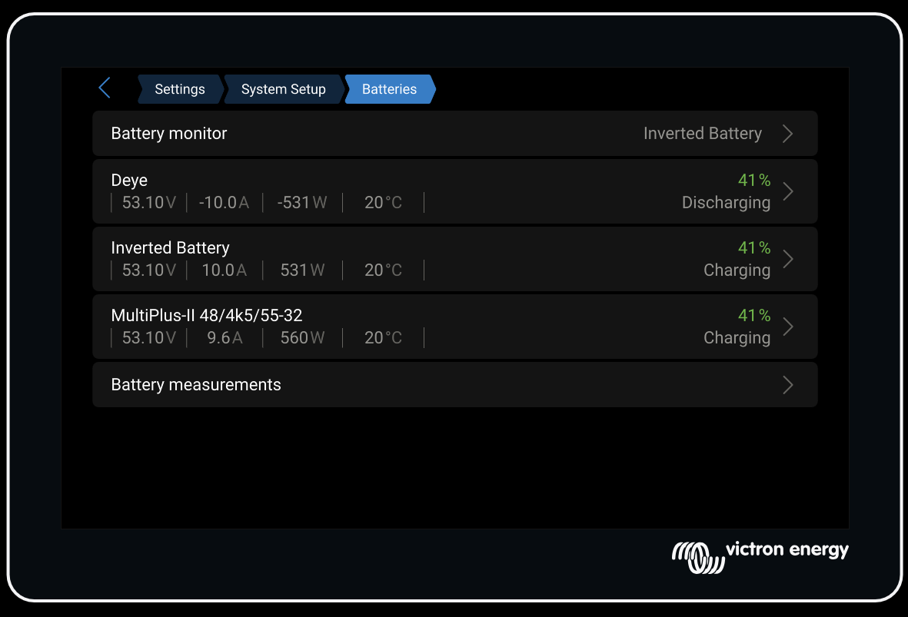

# Deye Battery CAN for Victron

[Deutsche Version](README.de.md)

This project started as a small workaround for a Deye battery on Victron Venus OS where the battery current was reported with the wrong sign.

It has since evolved into a broader **Deye battery CAN integration for Victron**, with an optional virtual battery layer for cases where the current direction still needs to be corrected.

## What this project is now

The repository currently contains two related components:

1. **A Deye CAN battery source driver** that reads Deye battery frames from SocketCAN and publishes them as a Victron battery service on DBus.
2. **A virtual battery mirror** that mirrors an existing DBus battery service, inverts the current direction, and mirrors almost all other battery paths automatically.

You can use either one on its own, or chain them together.



## Recommended mental model

Think of this repo primarily as:

- **Deye Battery CAN implementation on Victron**

And secondarily as:

- **optional virtual battery correction layer**

That reflects what the project has become in practice.

## Current status

### Option A: Publish a Deye battery directly from CAN
The Deye source driver listens on SocketCAN and publishes a Victron battery DBus service for a Deye battery.

It currently decodes the Deye summary frames that were visible in my logs, including:

- battery voltage
- battery current
- battery power
- SoC
- SoH
- battery temperature
- MOS temperature
- max charge voltage
- max charge current
- max discharge current
- battery low-voltage limit
- charge/discharge allow flags
- min/max cell voltage
- min/max cell temperature
- module counts
- cycle count
- raw alarm flags
- selected firmware / serial string fragments when present

The installed battery capacity is taken from the environment variable `BATTERY_CAPACITY_AH`. For a Deye RW-F16 the correct value is typically **314 Ah**.

The available capacity shown on GX is calculated from:

- installed capacity
- current SoC

### Option B: Mirror an existing battery service and invert the sign
This remains useful when your battery is already present on DBus, but current direction is backwards.

The virtual battery service:

- mirrors voltage
- mirrors SoC
- inverts current
- recalculates power from the mirrored voltage and current
- mirrors almost all other battery paths automatically through DBus discovery

### Option C: Use both together
This is the recommended setup when:

- your Deye data is not yet exposed on DBus, and
- the Deye current sign still needs correction for Victron.

In that setup:

- `dbus-deye-can-battery.py` publishes `com.victronenergy.battery.deye_vecan0`
- `dbus-virtual-battery.py` mirrors that service into `com.victronenergy.battery.inverted_vecan0`

## Which setup should you use?

Use **only the Deye source driver** if you want a native Deye battery service on DBus and the current sign already looks correct in your environment.

Use **only the virtual battery** if your real battery already appears in `dbus-spy` and you only want to fix sign direction.

Use **both together** if you are integrating a Deye battery from CAN and still need sign correction for GX/VRM.

## Project naming note

The repository name still contains the older `virtualbattery-inverted` wording because that was the original project focus.

At this point, the codebase has clearly grown beyond that. A better long-term name would be something like:

- `victron-deye-can-battery`
- `deye-battery-victron`
- `victron-deye-bms`

For now, this repository remains the active home of the project, but the documentation now reflects the broader scope.

## Check the battery service name first
Before installing anything, connect to your Cerbo GX over SSH and run:

```sh
dbus-spy
```

Look for battery services that start with `com.victronenergy.battery`.

Common examples:

- `com.victronenergy.battery.socketcan_vecan0`
- `com.victronenergy.battery.deye_vecan0`
- `com.victronenergy.battery.inverted_vecan0`

## Installation on Cerbo GX

### 1. Enable SSH
- On the Cerbo GX, go to `Settings -> General -> Access Level`
- Set it to `User and Installer` using password `zzz`
- Under `Firmware -> Online Updates`, set a superuser password
- Enable `SSH on LAN`

### 2. Download the files

```sh
mkdir -p /data/dbus-virtual-battery
wget -O /data/dbus-virtual-battery/dbus-virtual-battery.py https://raw.githubusercontent.com/NorthyIE/victron-virtualbattery-inverted/main/dbus-virtual-battery.py
wget -O /data/dbus-virtual-battery/dbus-deye-can-battery.py https://raw.githubusercontent.com/NorthyIE/victron-virtualbattery-inverted/main/dbus-deye-can-battery.py
wget -O /data/dbus-virtual-battery/install.sh https://raw.githubusercontent.com/NorthyIE/victron-virtualbattery-inverted/main/install.sh
chmod +x /data/dbus-virtual-battery/dbus-virtual-battery.py
chmod +x /data/dbus-virtual-battery/dbus-deye-can-battery.py
chmod +x /data/dbus-virtual-battery/install.sh
```

### 3. Pick your mode

#### Deye CAN source only

```sh
INSTALL_DEYE_SOURCE=1 INSTALL_VIRTUAL_BATTERY=0 BATTERY_CAPACITY_AH=314 /data/dbus-virtual-battery/install.sh
```

Optional environment overrides:

```sh
CAN_INTERFACE=vecan0
SERVICE_NAME=com.victronenergy.battery.deye_vecan0
DEVICE_INSTANCE=101
BATTERY_CAPACITY_AH=314
CURRENT_SIGN_CORRECTION=-1
```

#### Existing DBus battery only

```sh
SOURCE_SERVICE=com.victronenergy.battery.socketcan_vecan0 /data/dbus-virtual-battery/install.sh
```

If your existing battery service has a different name, change `SOURCE_SERVICE` accordingly.

#### Deye CAN source plus virtual correction layer

```sh
INSTALL_DEYE_SOURCE=1 \
INSTALL_VIRTUAL_BATTERY=1 \
BATTERY_CAPACITY_AH=314 \
SOURCE_SERVICE=com.victronenergy.battery.deye_vecan0 \
/data/dbus-virtual-battery/install.sh
```

### 4. Make it survive reboots
On Venus OS, `/service` is rebuilt during boot, so the install script needs to run again after every reboot and firmware update. Add this boot hook:

```sh
grep -qxF "/data/dbus-virtual-battery/install.sh" /data/rc.local || echo "/data/dbus-virtual-battery/install.sh" >> /data/rc.local
chmod +x /data/rc.local
```

If you use custom environment variables, put them in `/data/rc.local` too. Example:

```sh
grep -qxF "INSTALL_DEYE_SOURCE=1 INSTALL_VIRTUAL_BATTERY=1 BATTERY_CAPACITY_AH=314 SOURCE_SERVICE=com.victronenergy.battery.deye_vecan0 /data/dbus-virtual-battery/install.sh" /data/rc.local || echo "INSTALL_DEYE_SOURCE=1 INSTALL_VIRTUAL_BATTERY=1 BATTERY_CAPACITY_AH=314 SOURCE_SERVICE=com.victronenergy.battery.deye_vecan0 /data/dbus-virtual-battery/install.sh" >> /data/rc.local
chmod +x /data/rc.local
```

Also make sure `Settings -> General -> Modification checks -> Modifications enabled` is turned on.

## What the installer does
The installer can create either or both of these services:

- `/service/dbus-deye-battery`
- `/service/dbus-virtual-battery`

It recreates the `run` files in `/data/conf/service/...`, relinks `/service/...`, and restarts the services.

Logs are written to:

- `/data/log/dbus-deye-battery/dbus-deye-battery.log`
- `/data/log/dbus-virtual-battery/dbus-virtual-battery.log`

## Restart and troubleshooting

Restart the Deye source service:

```sh
svc -t /service/dbus-deye-battery
```

Restart the virtual battery service:

```sh
svc -t /service/dbus-virtual-battery
```

Check status:

```sh
svstat /service/dbus-deye-battery
svstat /service/dbus-virtual-battery
```

Watch logs:

```sh
tail -f /data/log/dbus-deye-battery/dbus-deye-battery.log
tail -f /data/log/dbus-virtual-battery/dbus-virtual-battery.log
```

If the values still look wrong:

1. Double-check the battery service name in `dbus-spy`
2. Confirm that the Deye source service appears as `com.victronenergy.battery.deye_vecan0`
3. Confirm that the virtual service appears as `com.victronenergy.battery.inverted_vecan0`
4. If the current sign is still backwards, try changing `CURRENT_SIGN_CORRECTION` from `-1` to `1`
5. Restart the relevant service after every change

## Important limitations
The Deye source driver currently decodes the **summary / inverter-facing CAN frames** that were available in my logs. It does **not** yet decode the separate full per-cell InterCAN extended frames.

The virtual battery mirrors almost all source battery paths automatically, but it can only mirror data that really exists on the source battery DBus service.

## If you want to support it
If this project was useful and you feel like buying me a coffee, you can do that here:

- [paypal.me/northy](https://paypal.me/northy)

That is completely optional.

This is not an official Victron Energy product. Use it at your own risk.
